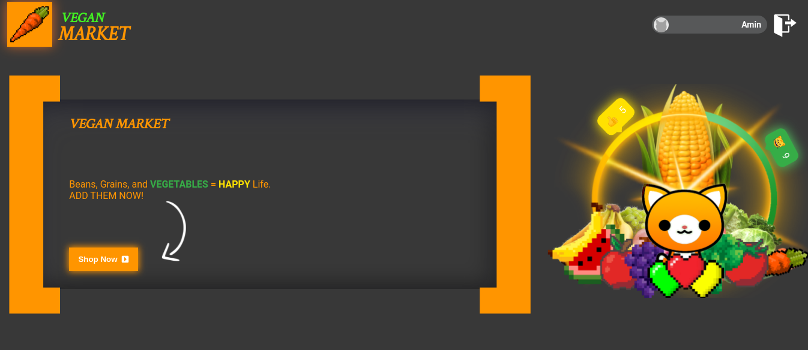
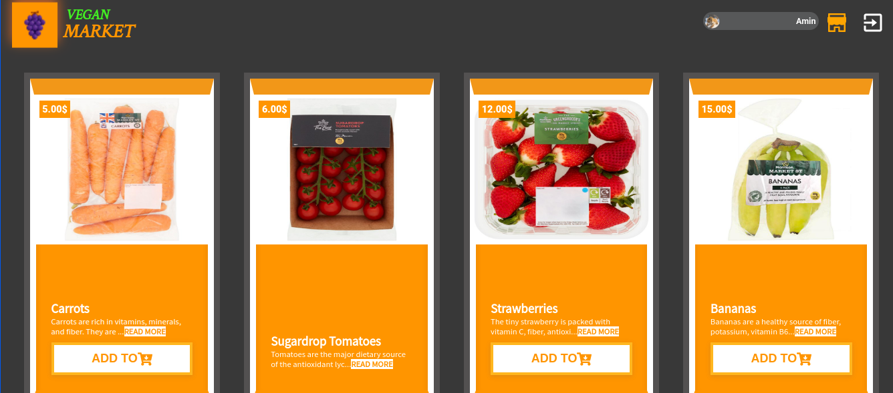
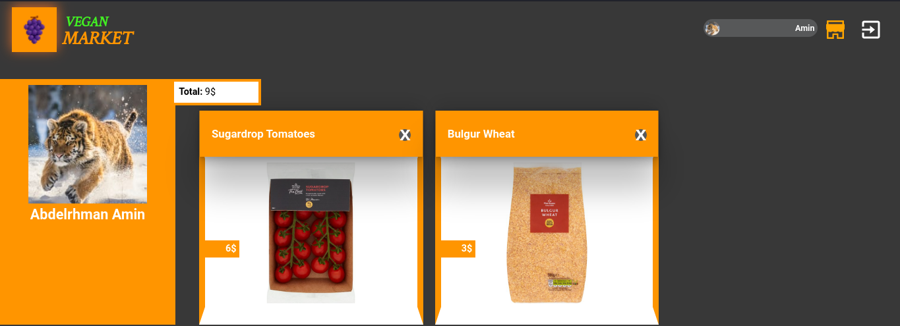

# 🥬 Vegan Market 🥕

> An E-commerce website where you can buy healthy vegan food

- I used Ruby on Rails as the backend to build the database and to create a REST API along with implementing other features.

- I used ReactJS to fetch and render the data.
- I used React-Redux as a state management tool.
- I used React-Router to create single page application and smooth navigation.
- I used GSAP to create animation.





## Built with

- Ruby on Rails
- REST API
- Heroku
- Netlify
- React
- GSAP
- React-Router
- React-Redux
- Thunk

## Video walkthrough

[](https://www.loom.com/share/e1457363dfe0490ba3796297f7f1900a)

## LIVE DEMO

**CURRENTLY NOT AVAILABLE**

### Setup

1- Clone the repository

```
    git clone https://github.com/AbdelrhmanAmin/E-commerce-React.git
```

2- Open the folder.

```
    cd E-commerce-React
```

3- install the app

```
    npm install
```

4- Run the app

```
    npm start
```

## Author

😎 **Abdo Amin**

- GitHub: [@Abdelrhman-Amin](https://github.com/AbdelrhmanAmin)
- LinkedIn: [@Abdo Amin](https://www.linkedin.com/in/abdoamin/)

## Show your support

Give a ⭐️ if you like this project!
